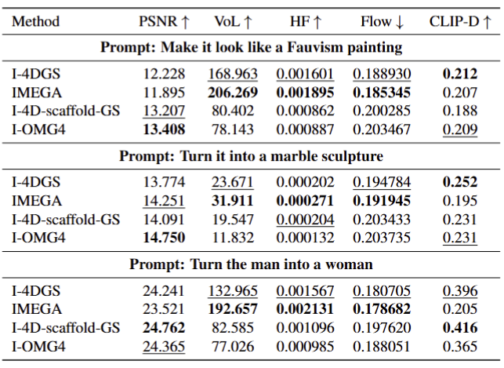
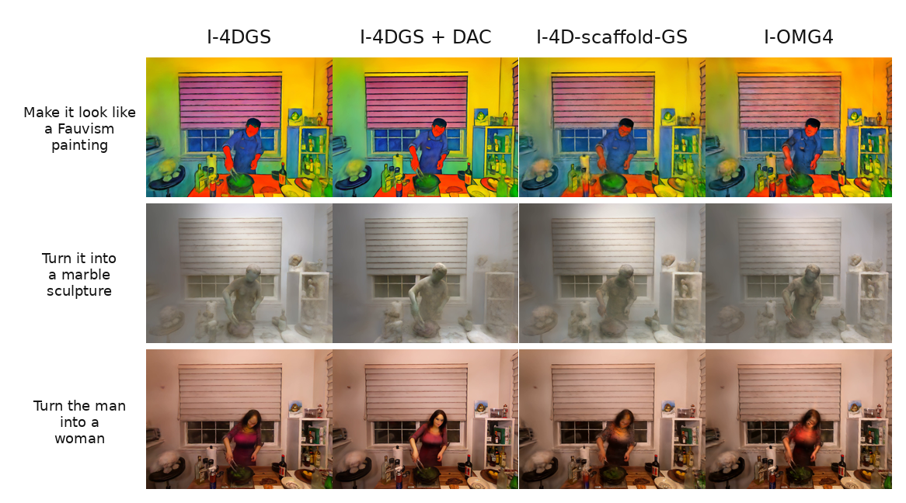

# What Makes a Good Backbone for Instruct-4DGS?

Given a reconstructed 4D Gaussian scene and a natural-language instruction, the goal of Instruct-4DGS is to generate an edited 4D scene whose rendered views satisfy the instruction while preserving the original scene geometry and maintaining temporal consistency across frames. Existing work, such as Instruct-4DGS (Kwon et al., CVPR 2025), performs editing solely on the static canonical 3D Gaussians and is built upon a single 4DGS backbone, leaving the influence of scene representation design largely unexplored. In this project, we investigate how different 4D Gaussian representations affect editing performance by replacing the original backbone with representative methods spanning two major paradigms: deformation-based representations, which model motion separately from the canonical 3D scene, and spatiotemporal-unified representations, which encode temporal information directly within the Gaussian representation. Through extensive comparisons, we find that deformation-based methods generally provide greater editability and better preservation of visual details due to appearance-motion disentanglement, albeit with weaker reconstruction quality. In contrast, spatiotemporal-unified methods achieve stronger reconstruction fidelity and more compact representations, but their tightly coupled appearance-motion design tends to limit editing flexibility. Our study provides a systematic analysis of the trade-off between reconstruction fidelity and editability in 4D Gaussian scene editing, offering insights into the role of scene representation in instruction-guided 4D content manipulation.

## 4dgs backbones

[Original instruct-4DGS](README_instruct4dgs.md)

[4d-scafflod-GS](https://github.com/jason-jasom/4dfgs-instruct)

[OMG4](https://github.com/jason-jasom/OMG4-Instruct)

[4DGS + DAC](https://github.com/felixhungsv/Instruct-4DGS-MEGA)

[Ex4DGS](Ex4DGS.md)

## Quantitative Results

## Qualitative Results 

